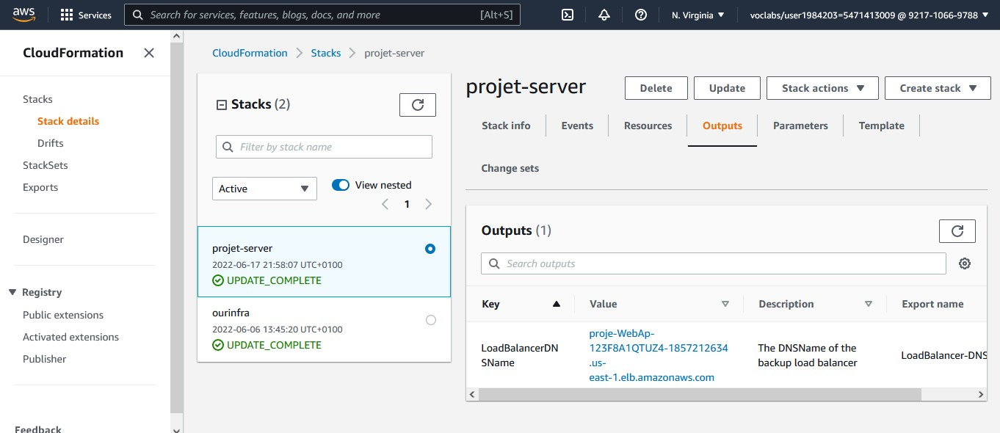

# Udacity Project 2
 - Name: Aworeni Abiodun
 - Date: June 17th, 2022 - 22:00 GMT+1

## Architecture Diagram


## Cloudformation_Output_LoadBalancer-DNS


## Web page screenshoot


## Create Infrastructure 
```
aws cloudformation create-stack --stack-name projcet-infra --template-body file://.\infrastructure.yml --parameters file://.\infrastructure-param.json --capabilities "CAPABILITY_IAM" "CAPABILITY_NAMED_IAM" --region=us-east-1

```

## Update Infrastructure 
```
aws cloudformation update-stack --stack-name projcet-infra --template-body file://.\infrastructure.yml --parameters file://.\infrastructure-param.json --capabilities "CAPABILITY_IAM" "CAPABILITY_NAMED_IAM" --region=us-east-1

```
## Delete Infrastructure 
```
aws cloudformation delete-stack --stack-name projcet-infra 

```

## Create server 
```
aws cloudformation create-stack --stack-name projet-server --template-body file://.\project-server.yml --parameters file://.\project-server-param.json --capabilities "CAPABILITY_IAM" "CAPABILITY_NAMED_IAM" --region=us-east-1

```

## Update server 
```
aws cloudformation update-stack --stack-name projet-server --template-body file://.\project-server.yml --parameters file://.\project-server-param.json --capabilities "CAPABILITY_IAM" "CAPABILITY_NAMED_IAM" --region=us-east-1

```

## Delete server 
```
aws cloudformation delete-stack --stack-name projet-server

```